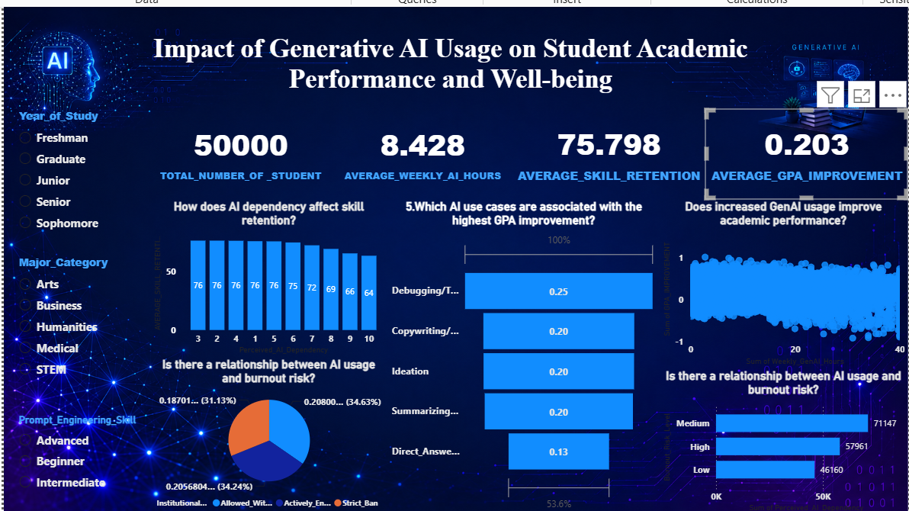

# IMPACT-OF-GENERATIVE-AI-USAGE-ON-STUDENT-ACADEMIC-PERFORMANCE-AND-WELL-BEING

## TABLE OF CONTENT

- [INTRODUCTION](#Introduction)

- [DATA SOURCE](#Data-Source)

- [PROBLEM STATEMENT](#Problem-Statement)

- [DATA COLLECTION AND PREPARATION](#Data-Collection-and-Preparation)

- [Skills demonstrated](#Skills-demonstrated)

- [Visualizations](#Visualizations)

- [Insight from analysis](#Insight-from-analysis)

- [Conclusion](#Conclusion)

- [RECOMMENDATION](#RECOMMENDATION)

## Introduction

Generative Artificial Intelligence (GenAI) has become an important technology in education, transforming how students learn, conduct research, complete assignments, and solve academic problems. Tools such as ChatGPT, Google Gemini, Microsoft Copilot, and Claude provide instant access to information, personalized learning support, and assistance with writing, programming, and problem-solving. As a result, the use of GenAI among students has increased significantly in recent years.
The growing adoption of Generative AI offers several potential benefits, including improved learning efficiency, better academic performance, reduced study time, and increased access to educational resources. However, concerns have also been raised about students becoming overly dependent on AI, reduced critical thinking, academic dishonesty, and the possible effects on mental well-being, such as anxiety and burnout.
Given these potential benefits and challenges, it is important to examine how Generative AI influences both students' academic performance and well-being. This study investigates the relationship between Generative AI usage and outcomes such as GPA improvement, skill retention, anxiety levels, and burnout risk. The findings will contribute to a better understanding of how AI can be used responsibly to enhance learning while supporting students' academic success and overall well-being.

## Data-Source
The dataset used in this study was obtained from an online educational resource and was created for learning and research purposes. It contains student-related information on Generative Artificial Intelligence (GenAI) usage, academic performance, and well-being. The dataset includes variables such as students' major category, year of study, pre- and post-semester GPA, weekly GenAI usage hours, primary use case of AI, prompt engineering skill, AI tool diversity, traditional study hours, perceived AI dependency, institutional AI policy, anxiety level during examinations, skill retention score, burnout risk level, and GPA improvement. The dataset was used to examine the relationship between Generative AI usage, students' academic performance, and well-being through data analysis and visualization using Power BI.

## Problem-Statement
This dataset examines how university students across different disciplines utilize Generative AI tools and how usage patterns relate to academic outcomes, skill retention, anxiety levels, and burnout risk. It combines demographic, behavioral, institutional, and performance-related variables to evaluate the educational impact of AI-assisted learning. The analysis seeks to answer the following questions:
- Does increased GenAI usage improve academic performance?
- How does AI dependency affect skill retention?
- Is there a relationship between AI usage and burnout risk?
- Do institutional AI policies influence student outcomes?
- Which AI use cases are associated with the highest GPA improvement?

## Data-Collection-and-Preparation 
#### Raw data:
The dataset on IMPACT-OF-GENERATIVE-AI-USAGE-ON-STUDENT-ACADEMIC-PERFORMANCE was obtained from Kaggle.
[Download IMPACT OF GENERATIVE AI USAGE ON STUDENT ACADEMIC PERFORMANCE ](Impact.csv)

### Tools used: 
        - MICROSOFT Excel - Data Cleaning and Transformation
        - Powerbi - Data visualization and dashboard development.
        - DAX - Creation of calculated measures and KPIs. 
        
## SKILLS DEMONSTRATED:
 - Excel:
    - Checked and removed duplicates to ensure data quality and accuracy.
    - Created a new column named GPA_IMPROVEMENT by calculating the difference between the Post-Semester GPA and the Pre-Semester GPA (Post_Semester_GPA Pre_Semester_GPA). This derived variable was used to measure changes in students' academic performance after a semester of Generative AI usage.
    - convert it as a Table

 - Powerbi:
     - importing the dataset from the excel
     - creating the measures using DAX (Data Analysis Expressions) to perform dynamic calculations. These measures included Total_number_of _student,average_weekly_ai_hours, average_skill_retention, average_gpa_improvement
  
  ## Data Analysis:
 - Perceived_AI_Dependency by Average_Skill_Retention
 - Institutional_Policy by Average_GPA_Improvement
 - Primary_Use_Case by Average_GPA_Improvement
 - sum of Weekly_GenAI_Hours by Sum of GPA Improvement
 - Burnout_Risk_Level by sum of Perceived_AI_Dependency

## Visualizations:
 - 

## Insight from analysis
- Students who used Generative AI more frequently generally showed greater GPA improvement, suggesting that appropriate use of AI tools may positively support academic performance.
- Students with higher perceived AI dependency tended to have lower skill retention scores, indicating that excessive reliance on AI may reduce long-term knowledge retention.
- Burnout risk varied across students with different levels of AI usage, indicating that the amount of time spent using AI may be associated with students' academic stress and well-being.
- Student outcomes differed across institutional AI policy categories, suggesting that university policies on AI use may influence academic performance and learning experiences.
- The analysis indicates that Generative AI can enhance academic performance when used as a learning support tool. However, excessive dependence on AI may reduce skill retention, highlighting the importance of responsible AI use. Institutional policies and the way students use AI also appear to influence academic outcomes and student well-being.

## Conclusion
- This study examined the impact of Generative Artificial Intelligence (GenAI) on students' academic performance, skill retention, and well-being. The findings indicate that GenAI has the potential to enhance academic outcomes when used responsibly as a learning aid. Students who effectively integrated AI into their study routines generally demonstrated improvements in academic performance.
However, the analysis also suggests that excessive dependence on AI may negatively affect skill retention, as students who rely heavily on AI may have fewer opportunities to develop and reinforce their own knowledge and problem-solving abilities. In addition, the relationship between AI usage and burnout highlights the importance of maintaining a healthy balance between technology-assisted learning and independent study.

# RECOMMENDATION
- Institutions should provide academic support services, time management training, and mental health resources to help students manage stress and reduce the risk of academic burnout.
- ducational institutions should encourage students to use Generative AI as a learning support tool rather than as a replacement for independent thinking and problem-solving.
- Training programs and workshops should be organized to improve students' AI literacy, including effective prompt engineering, critical evaluation of AI-generated content, and responsible AI usage.

